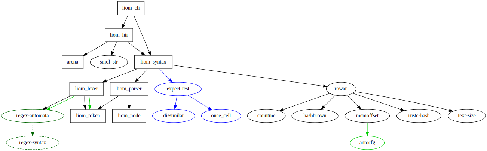

# The Liom Programming Language

Liom is a toy programming language I created as a learning experience. For more information on the syntax,
see [here](docs/syntax/syntax.md).

### Features

#### Parser

- [X] Variable definition
- [ ] Literal expression
    - [X] Integer
    - [ ] Character
    - [ ] String
    - [ ] Byte
    - [ ] Float
    - [ ] Boolean
- [X] Variable reference
- [X] Binary expression
- [X] Unary expression

#### Interpreter

- [ ] Variable definition
- [ ] Literal expression
    - [ ] Integer
    - [ ] Character
    - [ ] String
    - [ ] Byte
    - [ ] Float
    - [ ] Boolean
- [ ] Variable reference
- [ ] Binary expression
- [ ] Unary expression

## Installation

### Requirements

- [cargo](https://www.rust-lang.org/learn/get-started) with a recent nightly toolchain
- (Optional) [cargo-fuzz](https://lib.rs/crates/cargo-fuzz) if you want to run the fuzzer

To build the executable :

```shell
cargo build --release
```

The executable will be in `target/release/liom_cli`

## Usage

To run the REPL :

```shell
target/release/liom_cli
```

## Contributing

I'm open to contributions, don't hesitate to open issues and submit PR. I try to keep the dependency graph small.



To format the code :

```shell
cargo fmt
```

To lint the code :

```shell
cargo clippy
```

To test the code :

```shell
cargo test
```

To fuzz the code :

```shell
cargo fuzz run main
```

## Acknowledgment

I want to thank [Aramis Razzaghipour](https://arzg.github.io) for his blog on [Eldiro](https://arzg.github.io/lang)
which inspired me to do this project.

I want to thank [Aleksey Kladov](https://matklad.github.io) for his posts from which I learned a lot about parser and
Rust.

I want to thank all contributors to [rust-analyzer](https://github.com/rust-analyzer/rust-analyzer) because it helped me
for the architecture of this project.

## License

Licensed under either of [Apache License, Version 2.0](LICENSE-APACHE) or [MIT license](LICENSE-MIT) at your option.

Unless you explicitly state otherwise, any contribution intentionally submitted for inclusion in this repo by you, as
defined in the Apache-2.0 license, shall be dual licensed as above, without any additional terms or conditions.
